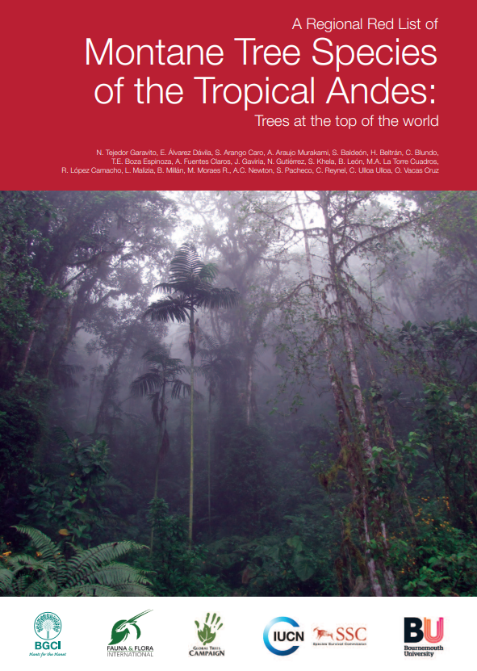

<!-- README.md is generated from README.Rmd. Please edit that file -->

```{r, include = FALSE}
knitr::opts_chunk$set(
  collapse = TRUE,
  comment = "#>",
  fig.path = "man/figures/README-",
  out.width = "100%"
)
```

# mtsta <a href='https://github.com/PaulESantos/mtsta'></a>


<!-- badges: start -->
[](https://lifecycle.r-lib.org/articles/stages.html)
[](https://CRAN.R-project.org/package=mtsta)
[](https://cran.r-project.org/package=mtsta)
[](https://cran.r-project.org/package=mtsta)

<!-- badges: end -->

This Red List of the tree species of the montane forests of the tropical Andes forms part of an ongoing research project to assess the conservation status and impact of climate change on the world’s montane tree species - trees at the “Top of the World”. The scope of this report is the tropical Andes in **Argentina, Bolivia, Colombia, Ecuador, Peru and Venezuela**

## Installation

You can install the released version of mtsta from [CRAN](https://CRAN.R-project.org) with:

``` r
install.packages("mtsta")
```

### Summary of results of this regional Red List report:

```{r summary_1, echo=FALSE}
summ_df <- tibble::tribble(
     ~Conservation.status, ~tag, ~Number.of.species,
  "Critically Endangered", "CR",                 1L,
             "Endangered", "EN",                42L,
             "Vulnerable", "VU",                27L,
        "Near Threatened", "NT",                20L,
          "Least Concern", "LC",                29L,
         "Data Deficient", "DD",                 8L,
          "Not Evaluated", "NE",                 0L
  )

summ_df |> 
  dplyr::select(1,3) |> 
  janitor::adorn_totals() |> 
  knitr::kable()
```

###  Number of endemic tree species by country in the tropical Andes (Calderón et al. 2002; IUCN 2010; León-Yánez et al. 2011; León et al. 2006; Llamozas et al. 2003; Meneses and Beck 2005) together with the results of this regional assessment.


```{r summary_2, echo=FALSE}
summ_2 <- tibble::tribble(
               ~Country, ~CR,  ~EN,  ~VU, ~NT, ~LC, ~DD, ~Subtotal,  ~NE, ~Total,
              "Ecuador",  2L,  36L,  52L,  9L,  5L,  1L,      105L,  61L,   166L,
                 "Peru",  9L,  31L,  15L,  2L,  3L, 10L,       70L,  50L,   120L,
             "Colombia",  4L,   5L,   5L,  2L,  1L,  0L,       17L,  60L,    77L,
              "Bolivia",  0L,   5L,   1L,  0L,  0L,  1L,        7L,  94L,   101L,
            "Argentina",  0L,   0L,   0L,  0L,  0L,  0L,        0L,   3L,     3L,
            "Venezuela",  0L,   0L,   0L,  0L,  0L,  0L,        0L,   0L,     0L,
        "Total endemic", 15L,  77L,  73L, 13L,  9L, 12L,      199L, 268L,   467L,
  "Regional assessment",  1L,  42L,  27L, 20L, 29L,  8L,      127L,   0L,   127L,
          "Total Andes", 16L, 119L, 100L, 33L, 38L, 20L,      326L, 268L,   594L
  )

summ_2 |> 
  knitr::kable()
```

